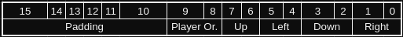
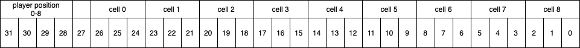

# Overview
## CSE379 - Lab 7
### Nathan Fox and Sebastien Bowen 

This is the website that will hold the documentation for Nathan Fox's and Sebastien Bowen's implementation of Atari Video Cube for the Atari 2600.  This is Lab 7 of CSE-379.

In this documentation, various examples of code will be done in Python.  The associated git repository will contain a large number of Python files.  This is because we will be sketching out ideas and algorithms in Python before implementing in ARM assembly, due to the ease of testing.

The project will also be stored in multiple files.  datastructures.s will be used to contain all the subroutines and macros for the main file, rng.s will contain the psuedo-random number generation, and library.s will contain all the small, generic and helpful subroutines that were created throughout the semester.  All of the .s files will be important for the project to work.# Movement

The character will move at a rate of two cells per second.  When onto a different face of the cube, the display matrix will pull the adjacent two columns from the new face and display them.  Then, after two game ticks which are half a second have occured, the new face will be fully rendered.

The orientation of the face will be based on the character's orientation, and only the display face's orientation will change.

## Subroutines

**move**:
This subroutine is what actually moves the player.  It does not take in any input, but takes in the player's intended direction of movement from the byte nextMovement, which is declared in handlers.s.  [**UART0_handler**](ints/uart.md) stores the player's next absolute movement as n, s, e, or w.  From these two pieces of information, **move** will calculate the new orientation, using [**new_o**](data/tables.md).  **Move** uses the nextMovement as an input to [**get_cell**](data/alist.md).  This gets us the new cell and new orientation.  Then, it calls [**detect_collision**](board/board.md) to check if the player is allowed to move.  If they are, the movement is committed, playerdata is changed and the subroutine exists.  If the movement is invalid, the subroutine simply exists.  Unfortunately, the number of moves is not tracked.  This was forgotten about.

What this subroutine does track is the action type, atype.  If the player moves onto a new face, atype is set to 2.  Otherwise it is set to 1.  Finally, it sets nextMovement to zero.  When nextMovement is zero, there is no movement pending.

**swap**:
This subroutine is called whenever the player pushes space.  It sets atype to 3.  It calls [**get_color**](data/alist.md) to find the color of the cell the cursor is currently on and sets the cursor's color to that.  It then sets the cell's color to the player's color.  RGB LEDs were not updated to reflect the player's color.
# Board

The board is displayed using a display matrix.  This display matrix was partially implemented by Sebastien.  The colors are stored in the [adjacency list](data/alist.md).  Various subroutine interact with the board, changing its state by changing the adjacency list.

# Subroutines

**detect_collisions**:
This subroutine determines if the movement is valid or not.  Using the information passed in of the new cell in r0, the player's color in r1, and returns a 0 or a 1 in r2.  It checks to see if the new cell's color is the same as the player's color that was passed in.  If it is, it returns a 1.  Otherwise, it returns a 0.

**check_board_state**:

This subroutine checks the state of the board.  Essentially, it checks to see if any of the faces are completed and if so, how many, by iterating through every single cell in the cell list and calling [**get_color**](data/alist.md).  It determines the color of the first cell of 9 and checks to see if the next 8 cells all have the same color as the first cell.  If so, it increments the number of completed faces by 1.  Repeat this for the other 5 faces.

After it iterates through the cell list, it 
# Board Layout and Rotation

The board will be laid out in memory using 7 matrices, and an adjacency list. 6 of these matrices represent the 6 faces of the cube.  The final matrix is the display matrix.  A table will represent the imposed rotation when the character moves between faces, if any.  The current character's orientation will be stored as an integer value 0-3, representing a rotation of 90 degrees times the integer value.

Each cell in the matrix will contain the color of that cell.  When we go to display one of the faces, we will copy the matrix we are displaying into the display matrix, and we will preform a composition of reflections and transposition based on the character's orientation.  

# Rotation

Rotation is implemented by taking the face matrix from memory and doing one or more transposes into row-reflections, which will rotate it by 90 degrees.  This was used to build the [adjacency list](../data/alist.md).  The player's orientation is stored in memory as a value from 0-3, representing the number of 90 degree counter clockwise turns the character has taken relative to the absolute North of Face 1.

Two lookup tables will be used to store rotation information.  The Face-Rotation table will take the current Face Number and tells you how the player's orientation will change when they move to a different face.  For example, moving East from Face 6 to Face 2 will cause the Player's orientation value to become 2.  This means compared to Absolute North of Face 1, we need to rotate the matrix containing Face 2 by 180 degrees.  This is achieved by composing two consecutive 90 degree rotations, or transpose -> row reflection -> transpose -> row reflection.  

The other lookup table will translate the player's input of wasd into cardinal directions, again based on the player's orientation.  For example, if the player has a orientation value of 1 and moves up, that is a movement East.

The full table can be found [here](https://docs.google.com/spreadsheets/d/1lIbhq9RJiK44gera0EY-gOZbGEYBQ-LJChw7v7JewIk/edit?usp=sharing).# Linear Algebra
# Adjaceny List

To store what cell is adjacent to what cell, to easily determine what color is an adjacent cell, an adjacency list will be constructed.  

This adjacency list will store the address in memory of each cell that is adjacent to the indexed cell.  For example, if we look to see what's adjacent to cell 500, we would index and find a list that contains the addresses cells 501, 510, 400, and 320.  The order of these is important, as this tells us the cardinal direction you travel to access it.  501 is East, 510 is South, 400 is North, and 320 is West.  

These cardinal projections are based on the orthographic, flattened projection of the Rubiks cube.  Absolute North is equivalent to moving up on Face 1 with zero rotation.  Each cell has an identifier of the face number, and cell number.  The player's direction, stored as a byte, will translate the Up, Down, Left, Right from w, a, s, and d into N, S, E, W using a lookup table.  

Currently, we are going to store 30 out of the 54 cells.  The reason is because for 24 cells, we don't need to store them and can easily calculate them based on the direction of movement and the current cell's index.  We will call these **In-Face Cells**.  Below is a example of it using face 1:

| 100     | 101     | 102     |
| ------- | ------- | ------- |
| **110** | **111** | **112** |
| **120** | **121** | **122** |

If the current cell is in the format XX0 or XX1, then going East will always result in adding 1 to the cell's index.  120 will become 121, 121 will become 122, etc.  The full list of rules is below:

| XX0/XX1 | X0X/X1X | X2X/X1X | XX1/XX2 | Dir |
| ------- | ------- | ------- | ------- | --- |
| +001    | N/A     | N/A     | N/A     | E   |
| N/A     | +010    | N/A     | N/A     | S   |
| N/A     | N/A     | -010    | N/A     | N   |
| N/A     | N/A     | N/A     | -001    | W   |

All other movements will need to be indexed using the adjacency list, but this removes the need to specify 24 cells in the .data section of the assembly program.  Less manual work is better.  The mapping of what cell is adjacent to what will be [in this google sheet.](https://docs.google.com/spreadsheets/d/1lIbhq9RJiK44gera0EY-gOZbGEYBQ-LJChw7v7JewIk/edit?usp=sharing)


## Color

The color is also stored in the alist, but only the indexing cell.  Meaning if you look through the adjacency table for cell 111, the color of cell 111 will be stored at that offset.  As the table is stored in hex, it would look like this if cell 111 was purple:

```arm

.half   0x6F06
```

It is stored this way in memory to account for the little endian architecture.  The largest 3 bits in this index stores the color, and the rest is the cell ID.  

## Subroutines

The following subroutines are availible for the adjacency list: (as of 2024-04-12)

**get_color**: Given an input cell ID in r0, returns the color of that cell in r0.

**set_color**:  Given an input CID in r0 and a color in r1, sets the color of that cell to the color givenn in r1.  Returns the new cell value in r0.

**extract_cid**:  Given a CID, returns the face number in r0, the row number in r1, nad the column number in r2.

**get_cell**:  Given a CID in r0 and a direction in r1, return the given cell from the alist in memory in r0 and the offset it took in r1.  You **must** provide a valid direction (0-4) in r1 or else the subroutine will crash.  Directions: 0 - East, 1 - South, 2 - North, 3 - West, 4 - No movement.  If given 4 in r1, will return the given cell from memory which includes color data.  

**dirindex**:  Given an input ascii character representing a cardinal direction or a number 0-3 that represents a cardinal direction, returns in r0 the character/integer version.# Data Structures Overview

We will be manually creating multiple data structures and subrotuines to handle these data structures. All of these data structures will be built first before all other subroutines to allow us to work with some level of abstraction.  The data structures created will be matrices and three lookup tables.

## Matrices

Seven matrices will be used, with six of these matrices representing the six faces of the cube.  The seventh matrix will be the display matrix, the only matrix that will actually be rendered.  These matrices will store metadata and data that contain information about the face number, the cell index in row,column format and the color contents of the cell.  

The display matrix will contain the player's avatar, and will be a copy of one of the six face matrices, except with a rotation imposed on it depending on the player's orienation.  To assist with this, three key linear algebra operations will be implemented:  Row Reflection, Column Reflection, and Transposition.  More information can be found in the [Rotation and Player Orientation](board/rot.md) chapter. <!-- This should convert and link to the compiled html page -->

## Lookup Tables

Three lookup tables will be created to simplify the logic: the Adjacency List (a-list), the Face Orientation table (foTab), and the Relative to Cardinal Direction table (rcdTab).  Important information will be stored in these tables, and multiple subroutines will be written to access the data in them.  Details about the latter two tables are described [here](./tables.md).

### Adjacency List

The a-list is a lookup table that specifies what each cell is adjacent to.  There will always be four other cells that are adjacent to the current cell, one for each of the cardinal directions.  The direction is specified both within the assembly implementation of it, and in the pattern.  The pattern used through is East-South-North-West.  So if you go to Cell ID 400 and go to offset 4, you will be looking for the cell to the West of Cell 400.  Details of implementation will be [here](./alist.md).

### Face Orientation Table

The foTab is a lookup table that tells you what the player's new orientation will be given the current face and the move the player is moving to.  For example, if the player is on Face 2 and moves to Face 6, the player will experience a rotation of 270 degrees.  This table is based off of the orthographic projection of the cube and is easiest to understand if you have a physical object such as a Rubik's cube to mimic the rotation change.  More details are found in [the rotation section](../board/rot.md).  

### Relative to Cardinal Direction Table.

The rcdTable is a lookup table that converts relative directions to the absolute, cardinal directions.  Relative directions are what the player inputs, up down left right from the w, a, s, and d keys.  Because what cell the player will move to when inputting a direction will change based on orientation, having some form of absolute direction to use as a stable index is vital.  

## Cells


The cells table is a list of every cell ID in the adjacency list, in order.  There are no associated subroutines that manipulate it directly, but it is used by the routine to fill the board with random colors.

## Player Data

This is a word stored in memory declared in lab_7.s.  It contains basic information about the state of the player.  The most-significant byte contains the player's orientation; the second most significant byte contains the player's current color; and the last two bytes contain the player's current position as a cell ID.
# Matrices

Multiple linear algebra subroutines will be implented to do basic linear algebra operations.  It will be stored as a contiguous block of memory, but these subroutines will allow us to abstract it away.

## Matrix Metadata 
The specific data type will be stored as "metadata" just before the first cell by pushing forward the offset by 4 bytes.  This gives a word of metadata to store information about what a particular instance of a matrix is used for, such as what face of the Rubiks Cube it represents.

For example, storing a 1 in this metadata will indicate the associated matrix is a matrix of half-words, meaning each cell will contain 2 bytes of data.

All the matrices used will start by using the .space assembler directive to allocate and clear enough memory to store the matrix.

## Indexing 
An index macro will be implemented to access these matrices by taking in two coordinate values, row and column, and calculating the offset in memory based on that information.  It will read the word of metadata to determine the size of each cell and take that into account when determining the offset.

Once the offset has been determined, it will load one cell of memory into register r0 and return that.

## Reflection and Transposition 
Clever iterating within a for loop will allow us to do matrix reflections.  Using example in Python for clarity:

~~~python
import numpy as np
def main():
    oldMat = np.array([
        [1,2,3],
        [4,5,6],
        [7,8,9]
    ])
~~~

The standard way to iterate through this matrix with a for loop would be with incrementing rows and incrementing columns.  An example would be copying the old matrix into a new matrix.

```python
    newMat = np.zeros([3,3])

    for row in [0,1,2]:
        for col in [0,1,2]:
            newMat[row][col] = oldMat[row][col]

```

```
newMat = [[1,2,3],[4,5,6],[7,8,9]]
```

Just by changing the order of iteration, we can preform reflections and transposition.  If you start at row 2 and iterate down, you can preform a reflection over row 1.

```python
def rowReflection(mat):
    shape = np.shape(mat)
    numRows = shape[0] - 1
    numCols = shape[1] - 1
    newMat = np.zeros([3,3])

    for row in range(3):
        for col in range(3):
            newMat[row,col] = mat[numRows - row,col]
    return newMat
```
```
newMat = [[7. 8. 9.], [4. 5. 6.], [1. 2. 3.]]
```

This method can also be used to preform column reflections, and transposition.  Composing these operations will allow for rotation.  This will be implemented in ARM using conditionally executing branches.# Lookup Tables

Three lookup tables have been created to assist with the development of this project: [the adjacency list](./alist.md), the Face Orientation Table and the Relative to Cardinal Direction Table.  This file will describe the format of the foTab and rcdTab.  

## Relative to Cardinal Direction Table
The Relative to Cardinal Direction Table is stored as a half-word array in the format: 


- Padding is just bits that are not used for anything but allow the data structure to adhere to word half-word alignment.  
- "Player Or." stands for Player Orientation, which is a value 0-3.  More information can be found in [the rotation docs](../board/rot.md).
- The 4 directional pairs are static and will always be in this pattern. You use this by translating the player's inputted direction, and those two bits will contain a number 0-3 that represents the corresponding cardinal direction.

### rcdTab Subroutines

**rcd**:
This subroutine takes in the current orientation of the character in r0 and the relative movement (wasd).  It converts wasd into NSEW by using mulitple IT blocks to calculate the offset to load a byte into the rcdtab.  It returns the absolute character that represents the direction the character is travelling in.


## Face Orientation Table
The Face Orientation Table is a lookup table that stores what the player's new orientation will be when moving between faces.  When moving from one face to another face, the player's orienation may change.  This table will describe how it changes.  The format is described below:


- Again, padding is just 0 bits that do not store data.
- New FID and Old FID are the face that the player is moving *to* and the face the player is moving *from* respectively.
- Cardinal direction represents the Cardinal direction needed to go from the current face onto the new face.
  - Encoded for redundancies' sake.
- New O. represents the new orientation of the player.  When moving from any face A to face B, the player may rotate their frame of view, depending on what faces A and B are.  This is useful for when the board must be rotated.

### fotab subroutines
**new_o**
New Orientation takes in a cell as a CID in r0 and the direction of movement the character is going to travel in r1.  It returns the new orientation of the character in r2.  It uses the previously described face orientation table to determine what the new orientation will be.  The given character in r1 **must** be n, s, e, or w or else the program will crash. 


### Utility Subroutines
**extract_cid**
Extract Cell ID is a utility subroutine that takes in a cell ID and extracts it, using the inverse of the formula to create a CID - 100*Face Number + 10*Row Number + Column Number.  So extract cid takes the cell ID and divides it by 100 and stores the quotient into r0. Then divide it by 10 and store it in r1.  Finally, it stores the remainder in r2.  Extract cid divides using the div_and_mod library subroutine.

**dirindex**
Dirindex is a small subroutine that was written because the standard of representing direction as 0123 to nsew, nsew to 0123, wasd to 10, 11, 12, 13.  It also converts 0x10, 0x11, 0x12, 0x13 to wasd.  All it does is convert between the various standards.
0 -> e, 1 -> s, 2 -> n, 3 -> w.
0x10 -> a, 0x11 -> s, 0x12 -> w, 0x13 -> d.
a -> 10, s -> 11, w -> 12, d -> 13.
e -> 0, s -> 1, n -> 2, w -> 3

The relative direction conversions were not used in the final version.
# Fault Handling

This documentation is not relavent to Lab 7 itself, but a rabbit hole and a seperate project Nathan Fox worked on.  Further documentation will be written whe nthe project is more complete.
# Pausing

When `sw1` has been hit, the game will go into a blocking loop inside the interrupt after disabling all other interrupts, including the timer.  This will be done using an `eor` instruction and a `beq` instruction.  The board will be replaced with a string that simply says "GAME PAUSED" and this will stay for the duration of the pause.#GPIO

GPIO is used for three things: 
- Pausing using SW1
- Displaying the number of completed faces
- Determining length of game.


**Pausing**:

Pausing is implemented in the timer handler and in the GPIO handler.  When sw1 is pressed, the gpio handler will load a memory value and xor it with 1.  Then in timer handler, there's a blocking loop that polls as long as the loaded memory value is 1.
# Random Number Generation

The random number generation is done by taking in an initial seed from Timer 1.  Timer 1 is initialized to a very, very large value instead of a very small value.  The timer must be initialized to a large value, like 0xFFFFFFFE, because it'll increment down every clock cycle.  Once the timer value hits zero, it'll repeat and rollover.  So if you have a small timer period, this will mean that the number of possible values it will take is significantly decreased.  Hence using a large number.

On the first UART interrupt, the UART handler will stop Timer 1, freezing its value.  With this value now being static, we can effectively use it as a seed value.  It is then stored in the label "seeddata" to make accessing it easier.

When filling the board, only the last 6 bits are used as an index.  After the bitmask to grab the last 6 bits, the seed is randomized using a simple Xorshift algorithm.  Xorshift was chosen due to its simplicitly to implement in assembly.  The one difference was that instead of setting the new seed to the time it takes for the randomized version to become the original, the seed is just xorshifted with 7, 13, 5, and 9.  This is because this process happens 1000 times, and getting the new seed with the original process would take an unreasonable amount of time.

# Filling the Board

To fill the board, a new data structure was created: the color list.  The color list is an array of 54 colors terminated with a 0xFF byte.  In its original form, the color list represents a "solved" version of the rubiks cube.  So the first face is all color 1 (red), the second is all color 2 (green), and so on.  The initial state of the board is pulled directly from iterating through this array and using the cells array to sequentially set each cell to its corresponding entry in the color array.

So naturally, the next question is "how do we randomize the color list?".  This is achieved using the initial seed in seeddata, and masking the for the last 6 bits.  They act as the first index.  The first index is then rotated 29 bits, and checked to see if they are greater than 54 or not using the subroutine **reduce** - we don't want to go out-of-bounds.  Now we have two indices to act as offsets into the color array.  The contents are then swapped.  The seed is randommized using the xorshift algorithm.  This proccess repeats 1000 times.

# Subroutines
**seed**: 
Seed does not take in any arguments.  It implements the algorithm described above and is called from the main subroutine.  After 1000 iterations, the subroutine will call **fill_alist**.  

**fill_alist**:
Fill adjacency list does not take in any arguments.  It iterates through the cells array with a post-indexed load to ensure it gets each cell.  It also loads each color from the color array with a post indexed load.  It then will call [**set_color**](data/alist.md) using the given cell and color to put it into the adjacency list, which acts as the entire board. 

To ensure every cell is filled with a color, two things were implemented data-wise:
- 0 does not represent a color, but the absence of color.  Having it represent a color would be extremely confusing.
- 0xFF is used as a terminating byte instead of 0x00

The iteration will only stop once the 0xFF byte has been read.


# Chapter 1
# mdBook Documentation and GitHub pages
All documentation will be hosted on GitHub pages, publically.  The docs will be written in Markdown and built in mdBook.  A single-file pdf will be used for submission for ABET accredidation purposes.# Division of Labor

Nathan Fox did almost everything.  Git logs are availible to prove this.  Sebastien worked on one file, which was display.s, and some documentation for that one file.  He started seriosuly writing code on Thursday, April 25th.  Two days before the deadline.

This was after pressure from Nate to commit his code, talking about implementations and even going to lab with him.  He still did not write code.  As of April 12th, he admitted he hadn't written any code.  As far as I can tell due to the stark lack of commits, this held true until Thursday.

On Friday, April 26th.  Date of the deadline.  He pushed his code and it did not work.  I personally was helping debug since I had nothing else to do, my job was done.  Sebastien's code in display.s was faulting and we were not able to fix this issue in time.  Generally due to his lack of work.

Sebastien did help with ideas.  But ideas are not code.  And what was needed was code.

To summarize, if the code was written in a file that is not display.s Nathan Fox wrote it.  If it is in display.s, Sebastien wrote it.
# UPDATE_DISPLAY

After initialization, UPDATE_DISPLAY is used at every tick to update the data stored and display the new, or current, state of the board. It first checks the type of action that was performed. 

If the last action was a move within the same face, disp_mat is updated so that the top 4 bits represent the new player position. If the previous action was to swap colors, then the player color is extracted from playerdata and inserted into the player's current position

If the action was a move onto a new face, adj_mat is build. The algroithm is similar to display_init seen in the [display structures doc](./displaystructs.md), but begins by pulling in the current face from player data, and inserting the colors into adj_mat. disp_mat is then replaced by adj_mat.

OUTPUT_SCREEN is called at the end of this conditional.

# OUTPUT_SCREEN

OUPUT_SCREEN is the final stage of output. It first prints the top/bottom bar, "+-----------------+". After a new line, it prints a side bar "|".

Then the orientation is found. This determines how disp_mat will be iterated through while printing, so that the orientation always points the player's "head" towards the top of the display. Orientation can be 0, 1, 2, 3-- corresponding to how many multiples of 90 degrees CCW they require for relative correction. For more on orientation, see [Rotatation](../board/rot.md) and [Look up tables](./tables.md).

For example, if orientation is 0, disp_mat can be iterated through with bits 26-18 representing cells 0, 1, and 2 of the outputted screen. The three code color values will be passed into [op_cell_row](./displaystructs.md). The mask will then right shift 9 bits to pass the second row of colors into op_cell_row.

The order of output of disp_mat can be visualized like the following:

>Orientation 0
>| |   |   |
>|---|---|---|
>| 1 | 1 | 1 |
>| 2 | 2 | 2 |
>| 3 | 3 | 3 |
>
>This requires a mask of b1111100000000011 1111111111111111. The mask is rotated right 9 >bits after each row is completed.

>Orientation 1
>| |   |   |
>|---|---|---|
>| 3 | 2 | 1 |
>| 3 | 2 | 1 |
>| 3 | 2 | 1 |
>
>This requires a mask of b1111 1 111 111 000 111 111 000 111 111 000. The mask is .>rotated left 3 bits after each row is completed.

>Orientation 2
>| |   |   |
>|---|---|---|
>| 3 | 3 | 3 |
>| 2 | 2 | 2 |
>| 1 | 1 | 1 |
>
>This requires a mask of b1111 1 111 111 111 111 111 111 000 000 000. The mask is >rotated left 9 bits after each row is completed.

>Orientation 3
>| |   |   |
>|---|---|---|
>| 1 | 2 | 3 |
>| 1 | 2 | 3 |
>| 1 | 2 | 3 |
>
>This requires a mask of b1111 1 000 111 111 000 111 111 000 111 111. The mask is >rotated right 3 bits after each row is completed.

After the rows are printed, The top/bottom bar is printed again, and the time and the moves are displayed beneath it.# Display Structures

To display what the backend has calculated the current state of the game to be. Main routine should be called every tick, or every half second.

There are two main data structures.

**disp_mat**: Stores the encoded state of the display directly before being outputted. 

**adj_mat**: Built to allow separation from past display and incoming display when cube is rotated to a new face.

Each data structure takes up a word and is formatted as so:


The three bit color values are the same as the ones used [in the alist docs](./alist.md). The top 4 bits store a value representing the player's position 0-8. 0-2 represent the first row, 3-5 second, and 6-8 third row. For example, if the current displayed face was like so, given bold represents the player's current position:

|           |           |              |
|---------- | --------- | ------------ |
| RED       | RED       | BLUE         |
| CYAN      | BLUE      | MAGENTA      |
| YELLOW    | **GREEN** | RED          |

The hex encoded disp_mat would like like the following:

```arm
.word   0x71334CD4
# 0111 0 001 001 100 110 100 101 011 010 100
```


# Subroutines
**display_init**: Initializes the first matrix to be displayed. Pulls color for given face 1 and inserted them into data structure with player position set to 4, or [1, 1]

**op_cell_row**: Outputs a full row of cells. Takes in three pointers to ansi esc strings with the colors of each cell in the current row. Prints the first layer of the three colors, including sidebars. In a new line, it checks for player position in these given cells. if player exists in the row, that cell will be given the player color during the second layer of printing. The third layer is printed like the first, just filling in the cell's color.

**player_pos**: Takes in row and column of player's current position and returns a number useful for the display, 0-8. For instance, if the player's current position in the backend shows [0, 0], player_pos returns 0. If the player is at [1, 2], player_pos returns 5.

**find_op_color**: Takes in a number 1-6 used in the background and returns a pointer to an ansi esc string representing the corresponding color. This is:
> red:      001
> 
> green:    010
> 
> yellow:   011
> 
> blue:     100
>
> magenta:  101
>
> cyan:     110