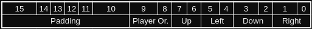

# Lookup Tables

Three lookup tables have been created to assist with the development of this project: [the adjacency list](./alist.md), the Face Orientation Table and the Relative to Cardinal Direction Table.  This file will describe the format of the foTab and rcdTab.  

## Relative to Cardinal Direction Table
The Relative to Cardinal Direction Table is stored as a half-word array in the format: 

- Padding is just bits that are not used for anything but allow the data structure to adhere to word half-word alignment.  
- "Player Or." stands for Player Orientation, which is a value 0-3.  More information can be found in [the rotation docs](../board/rot.md).
- The 4 directional pairs are static and will always be in this pattern. You use this by translating the player's inputted direction, and those two bits will contain a number 0-3 that represents the corresponding cardinal direction.

### rcdTab Subroutines

## Face Orientation Table
The Face Orientation Table is a lookup table that stores what the player's new orientation will be when moving between faces.  When moving from one face to another face, the player's orienation may change.  This table will describe how it changes.  The format is described below:

